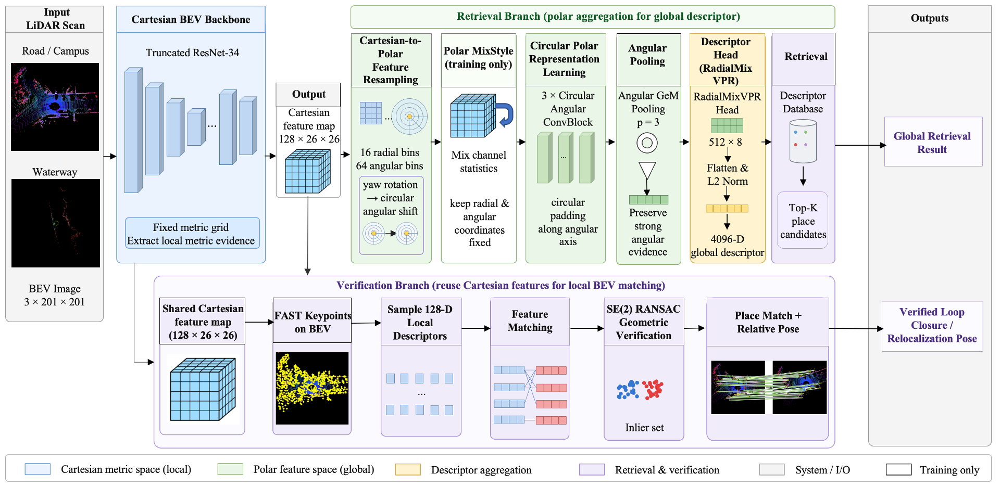

# Compute-Efficient Polar BEV Descriptors for Cross-Domain LiDAR Place Recognition on Road and Waterway Platforms

<p align="center">
  
</p>

<p align="center">
  <a href="#installation"></a>
  <a href="#installation"></a>
  <a href="#quick-start"></a>
  <a href="#citation"></a>
</p>

USVLoc is a compact LiDAR place recognition framework built around polar BEV descriptors. The model converts Cartesian BEV features into a polar representation, applies angular-aware aggregation and radial descriptor mixing, and produces efficient global descriptors for cross-domain retrieval on both road and waterway platforms.

This repository is an anonymized release of the core implementation for training, place recognition, loop closure, global localization, and real-world USV experiments.

> **Release Note**
> Additional code, usage notes, and pretrained model files will be released in this repository after paper acceptance.

## Highlights

- **Cross-platform LiDAR localization** for road scenes and inland waterway USV deployments.
- **Compute-efficient polar BEV descriptors** with Cartesian-to-polar resampling, circular angular modeling, polar self-attention, Angular GeM pooling, and RadialMix descriptor projection.
- **Unified evaluation scripts** for KITTI, NCLT, Pohang, USVInland, loop closure, global localization, and real-world USV experiments.
- **Ready-to-run checkpoint path** for reproducing the main place recognition and backend evaluations.

## Contents

- [Installation](#installation)
- [Repository Layout](#repository-layout)
- [Data Preparation](#data-preparation)
- [Checkpoint](#checkpoint)
- [Quick Start](#quick-start)
- [Training](#training)
- [Place Recognition](#place-recognition)
- [Loop Closure and Global Localization](#loop-closure-and-global-localization)
- [Real-World USV Experiments](#real-world-usv-experiments)
- [Outputs](#outputs)
- [Citation](#citation)

## Installation

Create a fresh environment:

```bash
conda create -n usvloc python=3.9 -y
conda activate usvloc
pip install -r requirements.txt
```

Core dependencies are listed in `requirements.txt`:

```text
torch
torchvision
numpy
pandas
opencv-python
PyYAML
scikit-learn
faiss-cpu
```

## Repository Layout

```text
usvloc/
  README.md
  requirements.txt
  configs/
    usvloc_default.yaml
  checkpoint/results/
    final_best_place/usvloc_best_place_recognition.pt
  figures/
    usvloc_architecture.png
  scripts/
    train.py
    eval_place.py
    eval_backend.py
    eval_hybrid.py
    ...
  usvloc/
    models/
    data/
    evaluation/
    backend/
    training/
```

## Data Preparation

The default scripts expect processed BEV data under:

```text
data
```

Typical layout:

```text
data/
  KITTI/00
  NCLT/2012-01-15
  Pohang/00
  USVInland/H05_7_Sequence_160_270
  USVInlandRaw/
```

If your data is stored elsewhere, override the path at runtime:

```bash
DATA_ROOT=/path/to/processed/data bash scripts/eval_kitti_nclt_pohang.sh
```

For USVInland place recognition, the raw dataset is read directly from:

```text
data/USVInlandRaw
```

Override it with:

```bash
RAW_ROOT=/path/to/usvinland bash scripts/eval_usvinland.sh
```

## Checkpoint

This release includes one checkpoint:

```text
checkpoint/results/final_best_place/usvloc_best_place_recognition.pt
```

It contains only the model `state_dict`. It does not include optimizer state, experiment history, or local machine paths.

## Quick Start

Evaluate KITTI place recognition:

```bash
GPU_ID=0 \
DATASET=kitti \
CHECKPOINT=checkpoint/results/final_best_place/usvloc_best_place_recognition.pt \
OUTPUT_DIR=outputs/eval_kitti \
bash scripts/eval_kitti_nclt_pohang.sh
```

Evaluate the USVLoc backend for loop closure and global localization:

```bash
GPU_ID=0 \
DATASETS="kitti nclt" \
CHECKPOINT=checkpoint/results/final_best_place/usvloc_best_place_recognition.pt \
OUTPUT_DIR=outputs/backend_usvloc \
bash scripts/eval_backend_usvloc.sh
```

Train from scratch:

```bash
GPU_ID=0 bash scripts/train_from_scratch.sh
```

## Training

The default configuration trains on the first 3000 frames of KITTI 00 and runs cross-dataset validation:

```bash
GPU_ID=0 bash scripts/train_from_scratch.sh
```

Common overrides:

```bash
GPU_ID=1 \
DATA_ROOT=/path/to/processed/data \
OUTPUT_DIR=outputs/train_from_scratch \
bash scripts/train_from_scratch.sh
```

Fast two-epoch debug run:

```bash
GPU_ID=0 \
EXTRA_ARGS="--set training.stage2.epochs=2 --set training.stage2.eval_every_epochs=1" \
bash scripts/train_from_scratch.sh
```

Resume from a checkpoint:

```bash
GPU_ID=0 \
CHECKPOINT=outputs/train_from_scratch/checkpoint_latest.pt \
OUTPUT_DIR=outputs/train_resume \
bash scripts/train_from_checkpoint.sh
```

If the checkpoint contains optimizer state, enable optimizer resume:

```bash
LOAD_OPTIMIZER=1 bash scripts/train_from_checkpoint.sh
```

## Place Recognition

### KITTI / NCLT / Pohang

Use `DATASET=kitti`, `DATASET=nclt`, or `DATASET=pohang`:

```bash
GPU_ID=0 \
DATASET=kitti \
CHECKPOINT=checkpoint/results/final_best_place/usvloc_best_place_recognition.pt \
OUTPUT_DIR=outputs/eval_kitti \
bash scripts/eval_kitti_nclt_pohang.sh
```

Enable 4-rotation query TTA:

```bash
python scripts/eval_place.py \
  --config configs/usvloc_default.yaml \
  --checkpoint checkpoint/results/final_best_place/usvloc_best_place_recognition.pt \
  --output-dir outputs/eval_kitti_tta \
  --query-tta \
  --set dataset.name=kitti \
  --set dataset.processed_root=/path/to/processed/data
```

### USVInland

```bash
GPU_ID=0 \
RAW_ROOT=/path/to/usvinland \
CHECKPOINT=checkpoint/results/final_best_place/usvloc_best_place_recognition.pt \
OUTPUT_DIR=outputs/eval_usvinland \
bash scripts/eval_usvinland.sh
```

## Loop Closure and Global Localization

Run the USVLoc backend:

```bash
GPU_ID=0 \
DATASETS="kitti nclt" \
CHECKPOINT=checkpoint/results/final_best_place/usvloc_best_place_recognition.pt \
OUTPUT_DIR=outputs/backend_usvloc \
bash scripts/eval_backend_usvloc.sh
```

The backend pipeline is:

```text
USVLoc global descriptor retrieval
Top-K retrieval candidates
Geometric verification and reranking
2D RANSAC + SVD-ICP pose estimation
```

Run the hybrid backend with an external local-geometry checkpoint:

```bash
GPU_ID=0 \
DATASETS="kitti nclt" \
USVLOC_CHECKPOINT=checkpoint/results/final_best_place/usvloc_best_place_recognition.pt \
LOCAL_GEOMETRY_CHECKPOINT=/path/to/local_geometry_head.pth.tar \
OUTPUT_DIR=outputs/backend_default \
bash scripts/eval_backend_default.sh
```

Run only global localization:

```bash
SKIP_LOOP=1 NO_RUNTIME=1 bash scripts/eval_backend_default.sh
```

## Real-World USV Experiments

The real-world USV dataset can be downloaded from:

https://drive.google.com/drive/folders/1-tDXa8Ew4Zaf3aOK9UiLtYk3F8XoK9Gp?usp=sharing

Recommended layout:

```text
data/Real-World USV Applications/
  frames.csv
  frames_with_pose.csv
  bev/
    1_2025-10-22-15-48-36/000000.png
    ...
```

Place recognition:

```bash
CUDA_VISIBLE_DEVICES=0 python scripts/eval_real_usv_place.py \
  --dataset-root "data/Real-World USV Applications" \
  --usvloc-ckpt checkpoint/results/final_best_place/usvloc_best_place_recognition.pt \
  --output-dir outputs/eval_real_usv_place
```

Global localization:

```bash
CUDA_VISIBLE_DEVICES=0 python scripts/eval_real_usv_global_localization.py \
  --dataset-root "data/Real-World USV Applications" \
  --place-dir outputs/eval_real_usv_place \
  --usvloc-ckpt checkpoint/results/final_best_place/usvloc_best_place_recognition.pt \
  --local-geometry-ckpt /path/to/local_geometry_head.pth.tar \
  --output-dir outputs/eval_real_usv_global_localization
```

## Outputs

Training outputs:

```text
outputs/train_from_scratch/
  config.json
  run_meta.json
  training_history.json
  training_history.tsv
  checkpoint_latest.pt
  checkpoint_epoch_*.pt
  model_best.pt
  best_metrics.json
```

Backend evaluation outputs:

```text
outputs/backend_default/<dataset>/global_loc/paper_global_loc_v4.tsv
outputs/backend_default/<dataset>/loop/paper_loop_v4.tsv
```

## Citation

If you use this repository, please cite the paper:

```bibtex
@article{anonymous2026usvloc,
  title   = {Compute-Efficient Polar BEV Descriptors for Cross-Domain LiDAR Place Recognition on Road and Waterway Platforms},
  author  = {Anonymous Authors},
  journal = {Under Review},
  year    = {2026}
}
```
